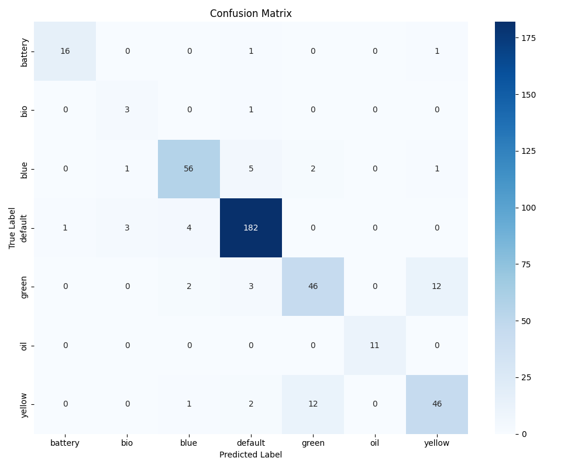

# Classificação de Contentores de Resíduos com ResNet50 e Focal Loss

> **Unidade Curricular:** Processamento de Dados Audiovisuais (2025/2026)
> **Licenciatura em Inteligência Artificial e Ciência de Dados**
> **Universidade da Beira Interior**

Este repositório contém a implementação de um sistema de Visão Computacional robusto para a classificação automática de 7 tipos de contentores de resíduos urbanos. O projeto foca-se na resolução de problemas de **desequilíbrio severo de classes** utilizando técnicas de *Deep Learning*.

---

## Resumo do Projeto

**O Desafio:**
O dataset fornecido apresentava um desequilíbrio crítico:
* **Classe Maioritária (Indiferenciado):** ~46% dos dados.
* **Classe Minoritária (Orgânico):** < 1% (Apenas 19 imagens no treino).

**A Solução:**
Em vez de treinar uma rede do zero (que ignoraria as classes raras), implementou-se uma estratégia de **Transfer Learning** combinada com uma função de custo ponderada:
1.  **Arquitetura:** **ResNet50** (pré-treinada na ImageNet) para extração de características robustas.
2.  **Loss Function:** **Focal Loss** ($\gamma=2.0$) para penalizar fortemente os erros nas classes difíceis/raras.
3.  **Estratégia de Pesos:** Penalização de **15.6x** para a classe "Orgânico" vs "Indiferenciado".

---

## Resultados Experimentais

O modelo atingiu uma performance de excelência no conjunto de validação (blind test simulado):

| Métrica | Valor |
| :--- | :--- |
| **Accuracy Global** | **87.9%** |
| **F1-Score (Weighted)** | **0.88** |
| **Recall (Óleo)** | **1.00** (11/11 acertos) |
| **Recall (Pilhas)** | **0.89** |

### Matriz de Confusão
A análise de erros revela que o modelo é extremamente robusto, com a principal fonte de erro localizada na distinção entre **Amarelo (Plástico)** e **Verde (Vidro)** devido à semelhança geométrica ("Iglu").



---

## Explicabilidade (XAI)

Para garantir que o modelo não sofre de *Clever Hans* (aprender o fundo em vez do objeto), utilizou-se a técnica **Grad-CAM**.
A rede foca-se nas características funcionais (ranhuras, sinalética) e ignora o chão.

---

## Estrutura do Repositório

```bash
TP_Audiovisuais/
├── Configuracoes_Redes/       # Pesos do modelo treinado (.pth)
├── src/                       # Código Fonte
│   ├── model.py               # Arquitetura ResNet50 modificada
│   ├── train.py               # Script de treino com Focal Loss
│   ├── evaluate.py            # Geração de métricas e gráficos
│   ├── predict.py             # Inferência individual + Grad-CAM
│   ├── prepare_data.py        # Script de validação do split estratificado
│   ├── explorar_dataset.py    # Análise exploratória da distribuição de classes
│   └── utils.py               # Transformações e Helper functions
├── submission_script.py       # Script de avaliação (Adaptador para o Professor)
├── requirements.txt           # Dependências do projeto
└── README.md                  # Documentação
```
---
## Como executar
1. Clone o repositório:
   ```bash
   pip install -r requirements.txt
    ```
   
2. Testar o Modelo:
Este script permite avaliar o modelo numa pasta de imagens arbitrária, gerando um CSV com as previsões.
   ```bash
   python submission_script.py
    ```
3. Treinar o Modelo:
    ```bash
   python src/train.py
    ```
---
## Autor
**Nome:** Ana Luísa Almeida Fernandes (Nº 51648)
Licenciatura em Inteligência Artificial e Ciência de Dados
Universidade da Beira Interior

---
   